# Mechanical Iris Storage Container
Storage container with dual-plane iris closing mechanism
## Showcase
### Renders:

  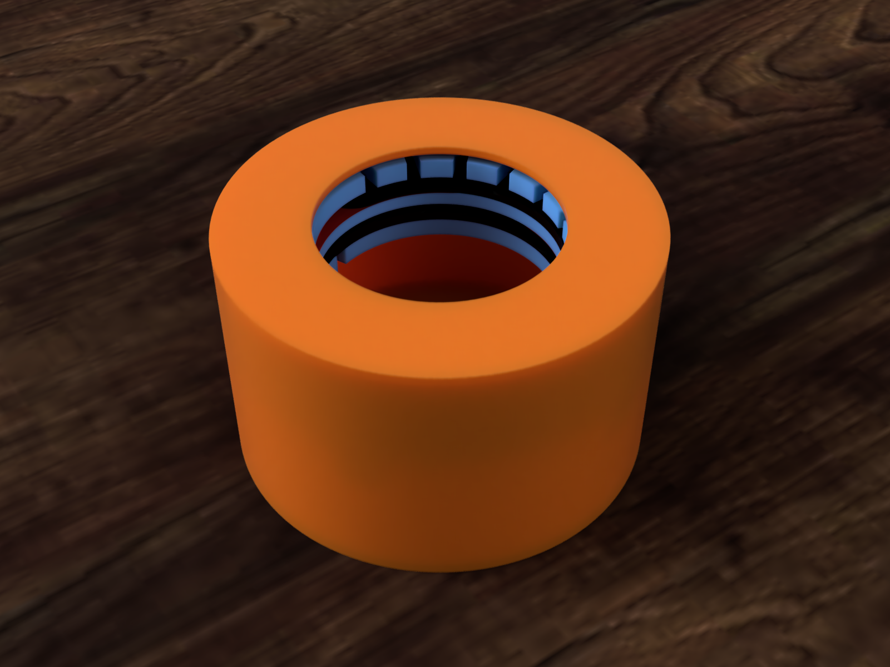
  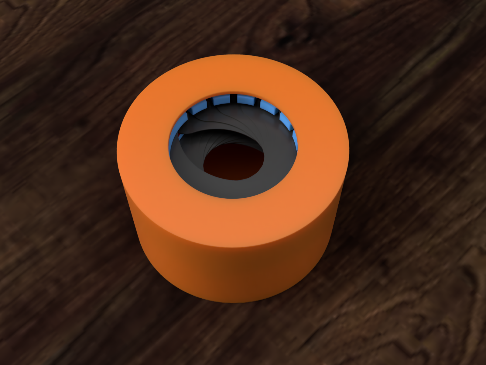

### Demo video:

# In short
The basic idea of the project was to create a circular container with a rotating lid that opens and closes an iris mechanism of some form, upon rotating the lid. The idea started upon seeing [this](https://www.printables.com/model/514762-mechanical-iris-container) model on printables (pictured below), and the research started from there

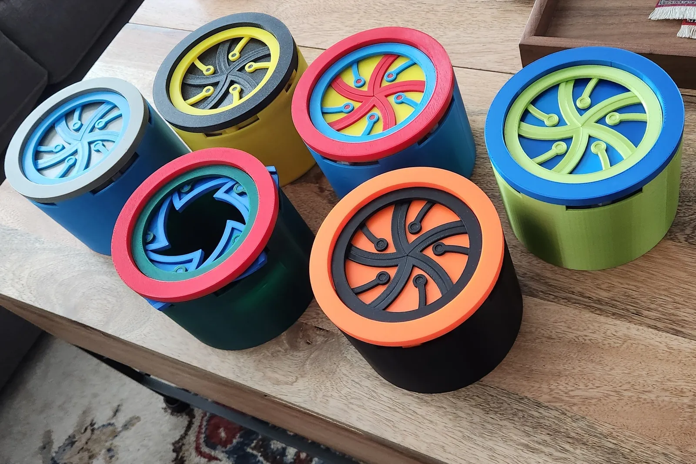

# Design process
The first step of the design process was deciding on the actual iris mechanism to use. The most important part about the mechanism was that I wanted it to be able to fully close. Starting from that, the one from the printables model above was interesting, but I disliked the fact that the blades fanned outward and I couldn't tell how I would build the trajectories for the blades to follow.  Throughout my research, I encountered many mechanisms similar to this one, which I came to name "Rotational translate" irises.
## "Sliding Iris"
The second type of mechanism I encountered was the "sliding iris", where the blades slide along a straight path to partially or completely cover the inner area of the iris. The design was practical and arguably the easiest to implement, but I disliked how once again, it either needed to have a very large ammount of space dedicated to storing the blades, or the blades would have to extend outside of the mechanism.

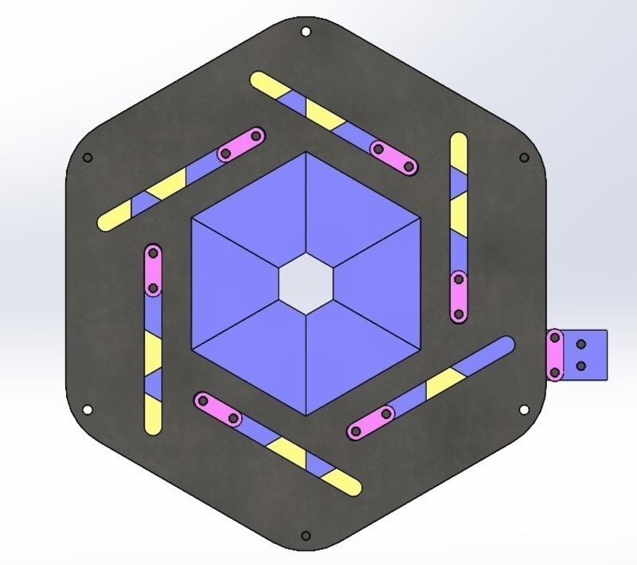

## Apperture
The third option I found was the traditional camera apperture mechanism. It had the advantage of a small external area but these mechanisms are not designed to close completely. It could be smaller than the others and in theory the most advantageous but ultimately it failed to meet the first requirement - closing completely. This is when I found the mechanism I would eventually choose.

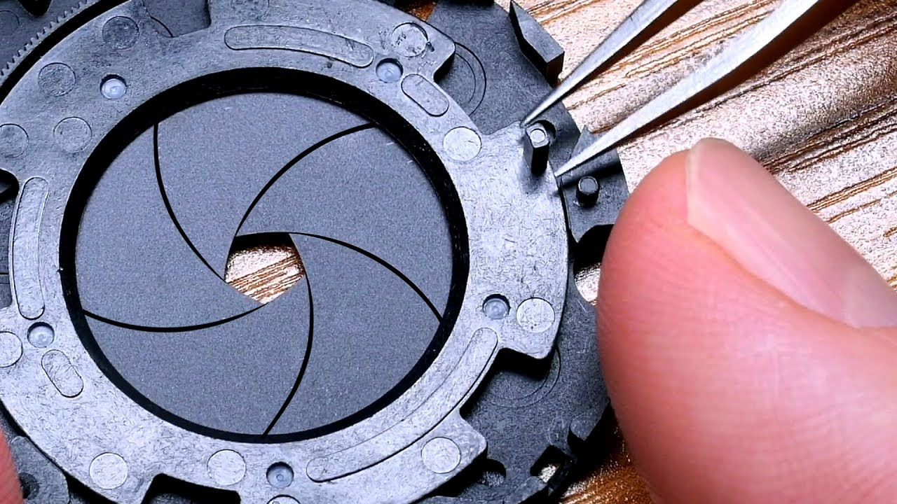

## Dual-Plane Iris
The mechanism I eventually chose was the Dual-Plane Iris. It functions very similarly to a regular apperture-type Iris and could generally be designed using the same principles, except it separated the blades into two planes. Half of the blades would sit on one plane, and the other half would sit on the other, while the actuator ring sat in the middle, driving them all. This prevented the blades from overlapping to the point where they wouldn't be able to close, and allowed for a fully closing mechanism

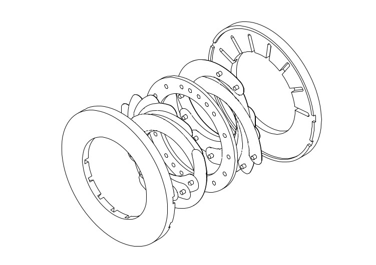

# Parts
## Slide rings
The "slide rings" have two roles: allow the blades to move back and forth to follow the actuator ring, and define the axis around which they will be rotating. The dual-plane design requires two slide rings. On a normal apperture mechanism, all of the slots would be on one single ring, but this design places half of the slots on one ring, and half of the slots on the other. The slots on the sides are practically just for the top ring. The body will have two pins that will hold the top ring in place. On that note, it is essential that both slide rings are held in place, the actuator is the only ring that should rotate. However, the slots are found on all the other rings to allow them to be inserted into the body. Additionally, the bottom ring has pin holes on the bottom that will hold it in place relative to the body (not shown)

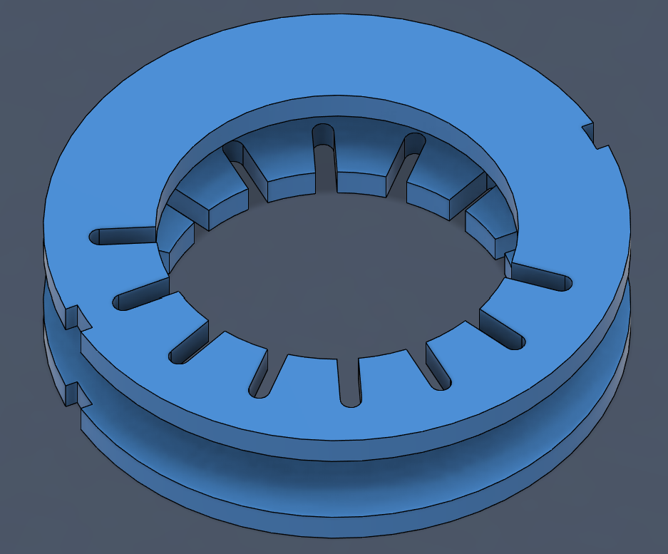

## Actuator ring
The actuator is the ring that moves the blades, "pulling" them along its' radius and making the iris close. On it, there are 16 pins for each of the regular blades, plus 4 pins that will hold two special "slip-blades", which will be explained later. The inner slots from the slide rings are prezent, as well as two additional outward slots. They will be used to spin the actuator ring from the lid of the container.
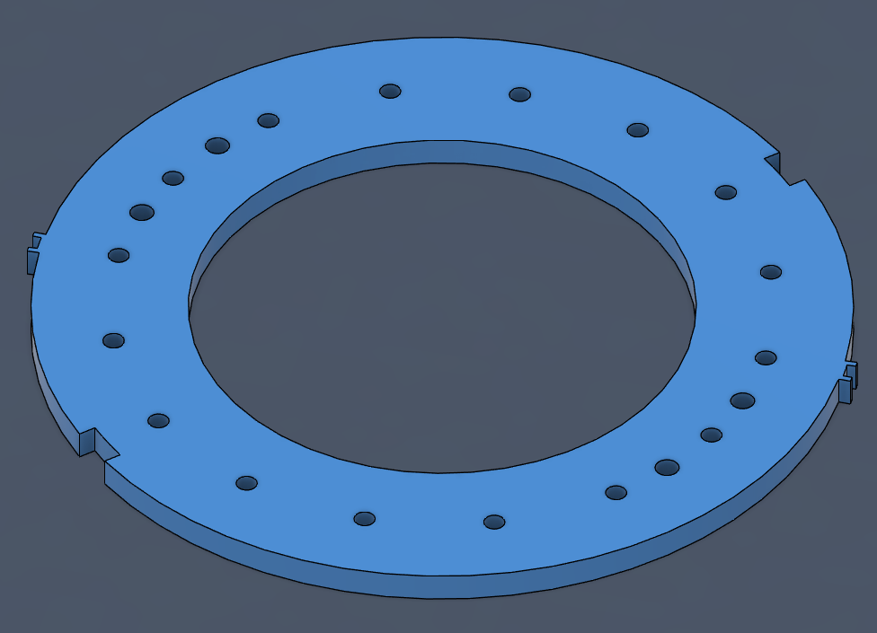

## Blades
### Normal Blades

All of the blades have the same shape, but they differ in how their pins are placed. The bottom blades have their "slide pin" pointing downards and their "actuator pin" pointing upwards. The top blades have their orientations and positions reversed. Additionally, if we were to design the blades in one single piece, they would be very difficult to print because of the two pins on opposing sides. Printing with supports would greatly complicate things, as these pins should be as thin and clean as possible. As such, the actuator pin is to be printed separately, and glued on. To facilitate this, the blade itself has a hole and slot for the pin to fit into, which can be seen on one of the blades pictured below. Another thing to note is that the pins need to be quite long. The blades will be placed on top of each other, and so the pins need to be long enough to reach their respective rings from a decent distance, determined by the thickness and number of blades.

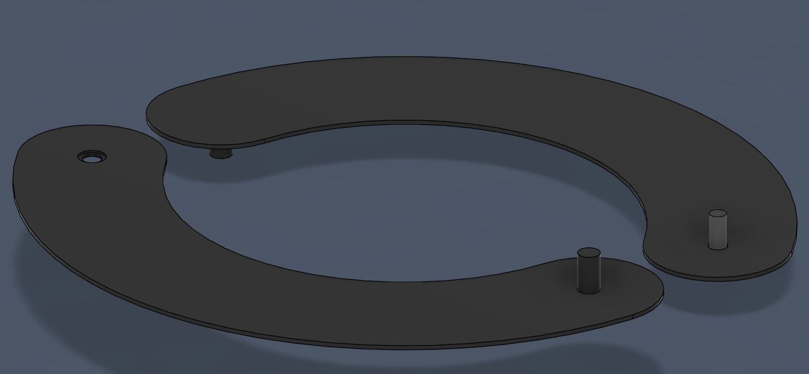

### Slip Blades
The slip blades have wo rigid pins on the same side of the blade, again mirroring the pins' position for the top and bottom. Their purpose is to sit on and along the actuator ring, to slip the blades above each other, so the actuator pins don't hit the slide pins. This will make more sense after the mechanism is presented

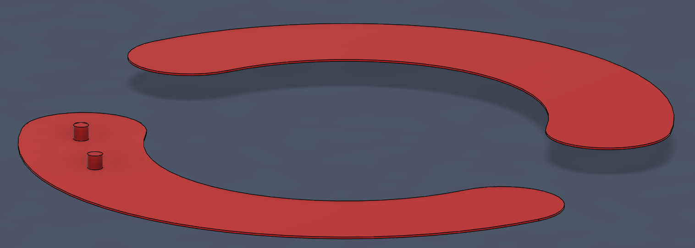

## Container body
The container components are in many ways much simpler than the other parts. The container body is a simple cylinder with one side open and a few pins added for holding the top and bottom sliding rings. The bottom ring supports are chamfered at a 45 degree angle, to support 3D printing.

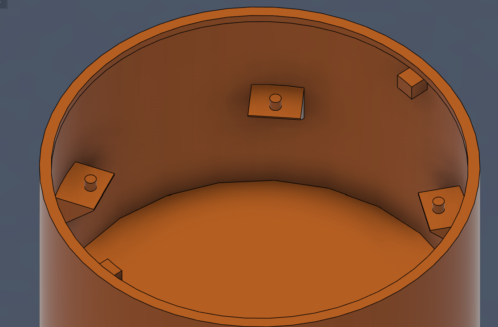

## Container Cap
The container cap has its' outer diameter equal to the outer diameter of the container and its' inner diameter equal to the inner diameter of the iris mechanism. Additionally, it has an extrusion that is meant to make it slot into the container, without sliding off of it. On top of that, it has two extending pins that reach the actuator ring, so that when the container cap is spun, it spins the actuator ring along with it, practically opening and closing the container

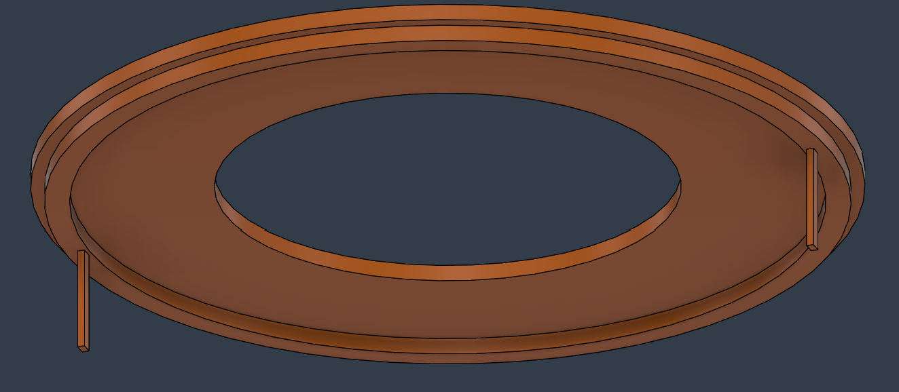

# Mechanism assembly and functioning
The blades are placed on top of each other, as shown, so that the slot pins don't hit any of the other blades. In reality, the blades would obviously not stay perfectly straight as shown, but would instead be dragged down by gravity and stay bent. That is intended. This is also the point in which the slip blades start to make sense. As the mechanism is right now, at about 65 degrees of rotation, the blade on the top would hit the slot pin of the blade on the bottom. 

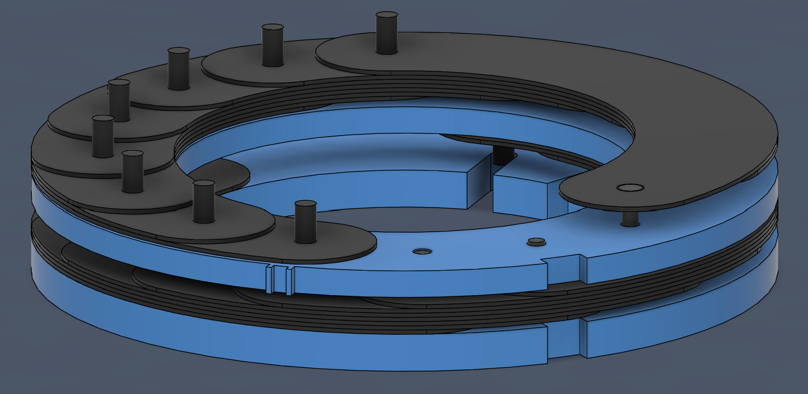

To prevent this, the  slip blade is mounted directly on the actuator ring, below the first blade, and its' other end is placed above the top blade. As such, the top blade(s) will slide downard, below the bottom blade(s). Additionally, because the slip blade rotates with the actuator ring, the top blades do not run into the mounting pins of the slip blade. The slip blade is not shown, because it would have to be bent above the top blade, and I don't know if fusion can do that.
The functioning of the slip blade is similar for the bottom half.

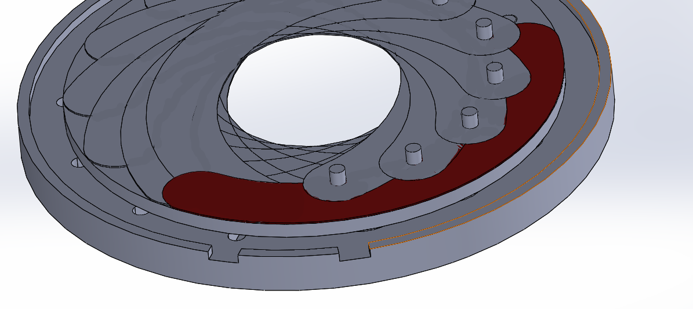

# Notes on the implementation and chosen dimensions
## Blade width 
As I have mentioned in the begining, I didn't want there to be too much space between the inner and outer diameter of the iris, and here, that depends on the width of the blades. Once again, the width of the blades depends on a few things. All of it starts with the closing diameter. The more you want the mechanism to close, logically, the more area the blades will need to cover. As such, the smaller the closing diameter, the thicker the blades need to be. However, this can be offset by the number of blades. A different way of covering the required area is to have more blades, allowing each individual blade to be thinner.
Originally, I started with a 12-blade design. However, once I had everything assembled and could test the entire mechanism, I noticed it didn't fully close. I experimented with making the blades wider, but ultimately felt I had to make them too thick. As such, I decided to switch over to a 16-blade design, and move to a new file. The blades are still wider than I'd like them to be, but I did not have time to experiment more before the deadline
## Blade height
In theory, the blades need to be as thin as possible. The height of the blades entirely determines the height of the entire mechanism, as the distance between each of the rings depends on the height of the blades and how many of them there are. On top of that, the blades cannot be too rigid, as they need to bend. Obviously, the more blades there are, the more critical it is for them to be as thin as possible

My problem in choosing the height of the blades was not knowing exactly how thin it would be reasonable to 3D print something, and how small details can be. Originally, I made the blades .4mm each, but I then realized I needed the slot and pin system to make the design printable. I was not sure if it would be reasonable to make the inner hole of the blade .2mm thick, so I made the blades .8mm and made the inner hole .4mm.
My problem with this is that because of the high thickness and the high number of blades, the iris mechanism itself is much, much taller than I would like it to be. However, I prefered to be safe, and left it like this for now
# Resources
https://www.printables.com/model/143497-mechanical-aperture/files
- base inspiration that sparked the idea for the entire project

https://www.youtube.com/watch?v=vCtbFtSfmnU&t=129s
- fusion tutorial for a 6-blade mechanical iris mechanism
- practically served as the foundation of the entire project

https://iris-calculator.com/full-closure/
 - main (and only) resource for dual-plane iris
 - includes [this](https://web.archive.org/web/20070207011241/http://www.wilkes-iris.com/flashIris/iris.htm) link to an interacteable demonstration of a dual-plane iris

https://www.youtube.com/watch?v=oH6GfyxpK9o 
- microscope aperture assembly, useful as a model for general assembly for these kinds of mechanisms

https://www.printables.com/model/143497-mechanical-aperture/files
- minor inspiration for 3D printed iris mechanism
